<div align="center">

<!-- ═══════════════════════════════════════════════════════════════ -->
<!--                    MOUNTAIN HEADER BANNER                      -->
<!-- ═══════════════════════════════════════════════════════════════ -->


<br/>

<!-- Animated name badge -->
<a href="https://github.com/XploitMonk0x01">
  
</a>

<br/>

**`root@XploitMonk0x01 ~ $ cat whoami.txt`**

> *Malware Analyst · Reverse Engineer · Digital Forensics Investigator*
> 
> *B.Tech CSE (Quick Heal Specialization) · Parul University · 7th Semester*

<br/>

[](https://linkedin.com/in/chandansemwal)
[](https://github.com/XploitMonk0x01)
[](mailto:ethicalrobo06@gmail.com)

</div>


<!-- ═══════════════════════════════════════════════════════════════ -->
<!--                    CURRENT STATUS                              -->
<!-- ═══════════════════════════════════════════════════════════════ -->

## `🏔️ $ cat base_camp.log`

```yaml
Name     : Chandan Singh
Handle   : XploitMonk0x01
Location : India  🌏
Focus    : Malware RE · Memory Forensics · CTF Infrastructure
Status   : Building XploitVerse · Open to internships
Fun Fact : Released a Hindi-flavored compiler (merilang) on my Compiler Design exam day
```

> *"Like a glacier that carves mountains, persistence shapes mastery."*


<!-- ═══════════════════════════════════════════════════════════════ -->
<!--                      THE ARSENAL                               -->
<!-- ═══════════════════════════════════════════════════════════════ -->

## `🌲 $ ls -la /summit/arsenal/`

<div align="center">

<!-- Animated Skill Tree — each branch = a skill category, each node = a tool -->


</div>


<!-- ═══════════════════════════════════════════════════════════════ -->
<!--                      ACTIVE PROJECTS                           -->
<!-- ═══════════════════════════════════════════════════════════════ -->

## `🏔️ $ cat /expeditions/active.json`

### 🔴 [XploitVerse](https://github.com/XploitMonk0x01/XploitVerse) — *Ascending*

> A full-scale cybersecurity learning platform — carved from the raw stone, like HackTheBox but built from scratch.

```
Stack  : Node.js · Express · MongoDB · JWT (role-tiered: player / premium / admin)
Covers : Web · Network · Binary Exploitation
Notable: Immersive terminal-based CTF labs · Razorpay payment integration
         Helmet security headers · Winston logging · Rate limiting
```

<div align="center">


</div>


<!-- ═══════════════════════════════════════════════════════════════ -->
<!--                      CERTIFICATIONS                            -->
<!-- ═══════════════════════════════════════════════════════════════ -->

## `🎖️ $ cat peak_achievements.txt`

```
┌──────────────────────────────────────────────────────────────────┐
│  [✓]  Quick Heal Certified — Malware Essentials                  │
│  [✓]  Quick Heal Certified — VAPT Analyst                        │
│  [✓]  Quick Heal Certified — Network Security Analyst            │
│  [✓]  Quick Heal Certified — Mobile App Penetration Testing      │
│  [✓]  Quick Heal Certified — Cloud Infrastructure & Security     │
│  [✓]  Certified Network Security Practitioner (CNSP)             │
└──────────────────────────────────────────────────────────────────┘
```


<!-- ═══════════════════════════════════════════════════════════════ -->
<!--                      GITHUB STATS                              -->
<!-- ═══════════════════════════════════════════════════════════════ -->

## `📊 $ ./altimeter --fetch`

<div align="center">

<!-- GitHub Stats ✅ github-readme-stats-fast.vercel.app -->


<!-- Streak Stats ✅ github-readme-stats-fast.vercel.app -->


<!-- Top Languages ✅ github-readme-stats-fast.vercel.app -->


</div>


<!-- ═══════════════════════════════════════════════════════════════ -->
<!--                      LEARNING TRAIL                            -->
<!-- ═══════════════════════════════════════════════════════════════ -->

## `🌿 $ grep -r "next_summit" /var/log/mindspace/`

```python
next_summit = [
    "Advanced Malware Analysis (unpacking, obfuscation, C2 behaviour)",
    "Reverse Engineering — anti-debug, packer internals, firmware RE",
    "OSINT advanced techniques (GEOINT, sock puppets, graph pivoting)",
    "DFIR — memory forensics, timeline analysis, IOC extraction",
]

# Every trail, no matter how steep, leads to a better view.
```


<!-- ═══════════════════════════════════════════════════════════════ -->
<!--                      CONTRIBUTION SNAKE                        -->
<!-- ═══════════════════════════════════════════════════════════════ -->

## `🐍 $ watch -n 86400 contribution_trail.sh`

<div align="center">

<picture>
  <source media="(prefers-color-scheme: dark)" srcset="https://raw.githubusercontent.com/XploitMonk0x01/XploitMonk0x01/output/github-contribution-grid-snake-dark.svg">
  <source media="(prefers-color-scheme: light)" srcset="https://raw.githubusercontent.com/XploitMonk0x01/XploitMonk0x01/output/github-contribution-grid-snake.svg">
  
</picture>

</div>

<!-- ═══════════════════════════════════════════════════════════════ -->
<!--               ANIMATED SNOWFALL / NATURE OVERLAY               -->
<!-- ═══════════════════════════════════════════════════════════════ -->


<!-- ═══════════════════════════════════════════════════════════════ -->
<!--                      MOUNTAIN FOOTER                           -->
<!-- ═══════════════════════════════════════════════════════════════ -->


<div align="center">

```
┌──────────────────────────────────────────────────────────────────┐
│  🏔️  Open to: Internships · CTF Collabs · Research Roles        │
│  🌊  Reach me: ethicalrobo06@gmail.com                           │
│  🌲  The terminal is always open. The summit awaits.             │
└──────────────────────────────────────────────────────────────────┘
```

*"The mountains are calling, and I must go — but first, I'll reverse engineer the trail map."*

<br/>


</div>
