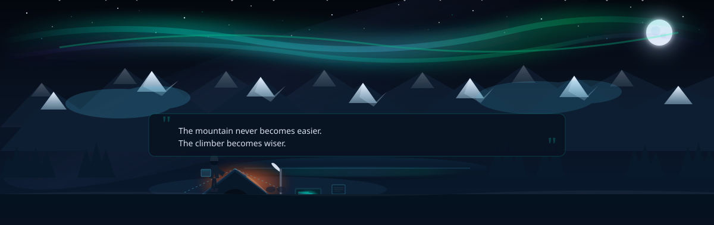
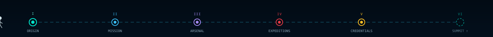
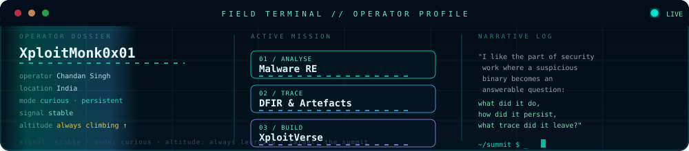
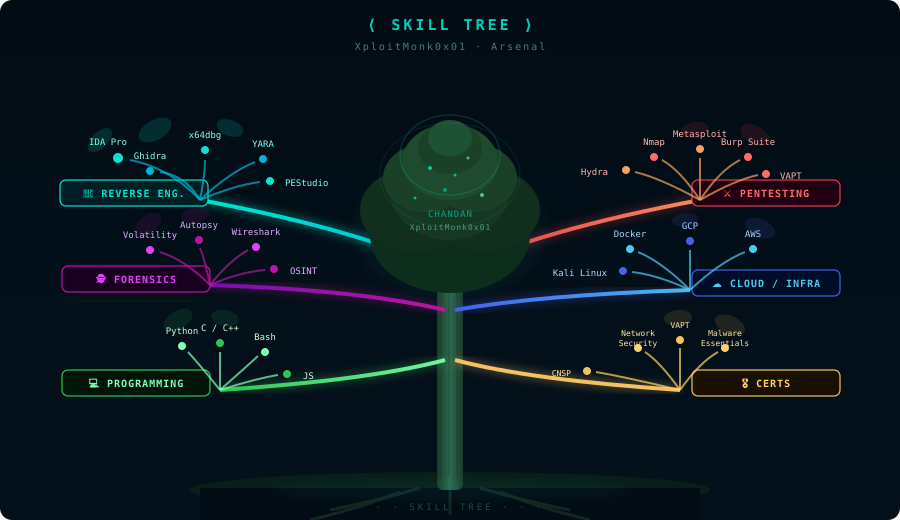
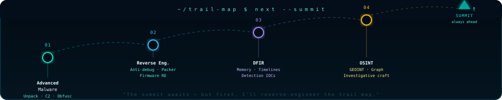
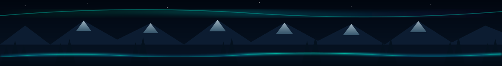

<div align="center">



<br/>

<a href="https://github.com/XploitMonk0x01">
  
</a>

<br/><br/>

[](https://linkedin.com/in/chandansemwal)
[](mailto:ethicalrobo06@gmail.com)
[](https://github.com/XploitMonk0x01)

</div>

<br/>



---

<!-- ═══════════════════════════════════════════════════════
     CHAPTER I — ORIGIN SIGNAL
     ═══════════════════════════════════════════════════ -->

<div align="center">

```
╔══════════════════════════════════════════════════════════╗
║            C H A P T E R   I  —  O R I G I N            ║
╚══════════════════════════════════════════════════════════╝
```

</div>

> *Every investigation starts with a single question.  
> Mine started with: "what did that binary actually do?"*

```yaml
operator : Chandan Singh
handle   : XploitMonk0x01
location : India
focus    : Malware RE · Memory Forensics · Threat Research · CTF Infrastructure
building : XploitVerse — a hands-on cybersecurity learning platform
open_to  : Internships · Research · CTF collaborations
```

I like the part of security work where a suspicious binary becomes an answerable question: what did it do, how did it persist, and what evidence did it leave behind? I'm building depth across reverse engineering, DFIR, and practical offensive security — one careful investigation at a time.

<div align="center">
  
</div>


<!-- ═══════════════════════════════════════════════════════
     CHAPTER II — THE MISSION FIELD
     ═══════════════════════════════════════════════════ -->

<div align="center">

```
╔══════════════════════════════════════════════════════════╗
║       C H A P T E R   I I  —  M I S S I O N             ║
╚══════════════════════════════════════════════════════════╝
```

</div>

> *The terrain: messy samples, volatile memory, and trails that go cold fast.  
> The gear: a debugger, a disassembler, and a refusal to give up.*

### `~/arsenal $ tree --focus`

<div align="center">
  
</div>

<details>
<summary><code>expand: field kit</code></summary>
<br/>

| Domain | Tools & practices |
| :-- | :-- |
| `reverse-engineering` | Ghidra · IDA Pro · x64dbg · PEStudio · YARA |
| `forensics` | Volatility · Autopsy · Wireshark · IOC extraction · timeline analysis |
| `offensive-security` | Burp Suite · Nmap · Metasploit · VAPT |
| `build-and-infra` | Python · Node.js · Express · MongoDB · Docker · Linux |

</details>


<!-- ═══════════════════════════════════════════════════════
     CHAPTER III — THE EXPEDITION
     ═══════════════════════════════════════════════════ -->

<div align="center">

```
╔══════════════════════════════════════════════════════════╗
║    C H A P T E R   I I I  —  E X P E D I T I O N        ║
╚══════════════════════════════════════════════════════════╝
```

</div>

> *Not a sprint — an expedition. Each project is a route up a new face.*

### `~/expeditions $ ls --active`

### ◉ [XploitVerse](https://github.com/XploitMonk0x01/XploitVerse) — `IN PROGRESS`

> An immersive cybersecurity learning platform: hands-on labs, terminal-first challenges, and a path from curiosity to capability.

```text
stack     Node.js · Express · MongoDB · JWT
tracks    Web · Network · Binary Exploitation
terrain   Role-based labs · payments · rate limiting · security headers · observability
```

<div align="center">


</div>


<!-- ═══════════════════════════════════════════════════════
     CHAPTER IV — VERIFIED ASCENTS
     ═══════════════════════════════════════════════════ -->

<div align="center">

```
╔══════════════════════════════════════════════════════════╗
║   C H A P T E R   I V  —  V E R I F I E D  A S C E N T S ║
╚══════════════════════════════════════════════════════════╝
```

</div>

> *Every cert is a cleared route — proof of the path, not the peak.*

### `~/credentials $ verify --earned`

```text
[✓] Quick Heal Certified — Malware Essentials
[✓] Quick Heal Certified — VAPT Analyst
[✓] Quick Heal Certified — Network Security Analyst
[✓] Quick Heal Certified — Mobile App Penetration Testing
[✓] Quick Heal Certified — Cloud Infrastructure & Security
[✓] Certified Network Security Practitioner (CNSP)
```


<!-- ═══════════════════════════════════════════════════════
     CHAPTER V — TELEMETRY
     ═══════════════════════════════════════════════════ -->

<div align="center">

```
╔══════════════════════════════════════════════════════════╗
║      C H A P T E R   V  —  T E L E M E T R Y            ║
╚══════════════════════════════════════════════════════════╝
```

</div>

> *Every commit is a footprint on the trail. Here's the map so far.*

### `~/telemetry $ fetch --public`

<div align="center">


<br/>


</div>


<!-- ═══════════════════════════════════════════════════════
     CHAPTER VI — THE TRAIL AHEAD
     ═══════════════════════════════════════════════════ -->

<div align="center">

```
╔══════════════════════════════════════════════════════════╗
║  C H A P T E R   V I  —  T H E  T R A I L  A H E A D   ║
╚══════════════════════════════════════════════════════════╝
```

</div>

> *The summit isn't a destination. It's the next visible waypoint.*

### `~/trail-map $ next`

```python
next_summit = [
    "Advanced malware analysis: unpacking, obfuscation, C2 behaviour",
    "Reverse engineering: anti-debugging, packer internals, firmware RE",
    "DFIR: memory artefacts, timelines, and detection-ready IOCs",
    "OSINT: GEOINT, graph pivots, and investigative tradecraft",
]
```

<div align="center">



<br/>

<picture>
  <source media="(prefers-color-scheme: dark)" srcset="https://raw.githubusercontent.com/XploitMonk0x01/XploitMonk0x01/output/github-contribution-grid-snake-dark.svg">
  <source media="(prefers-color-scheme: light)" srcset="https://raw.githubusercontent.com/XploitMonk0x01/XploitMonk0x01/output/github-contribution-grid-snake.svg">
  
</picture>



<sub>*"The mountains are calling — but first, I'll reverse engineer the trail map."*</sub>

</div>
